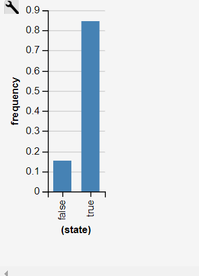
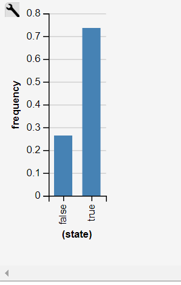

# Probabilistic Programming Analysis: Battery Pack

This project utilizes probabilistic programming to analyze scenarios involving a pack of AA batteries.
We employ generative models to estimate probabilities under certain conditions. The analysis was conducted using WebPPL, a probabilistic programming language.

#### Problem 1:
````
var batteries = function() {
    var battery1 = flip(0.9);
    var battery2 = flip(0.9);
    var battery3 = flip(0.9);
    var battery4 = flip(0.9);
    return [battery1, battery2, battery3, battery4];
};

var gen = function() {
    var pack = batteries();
    condition(_.some(pack, function(b) { return !b; }));
    return _.countBy(pack, _.identity).false === 1;
};

viz(Infer({method: "rejection", samples: 10000}, gen));
````

Result:



Probability of exactly three batteries being full: 29.12%


#### Problem 2:
````
var gen = function() {
    var battery2 = flip(0.9);
    var battery3 = flip(0.9);
    var battery4 = flip(0.9);
    var pack = [false, battery2, battery3, battery4];
    return _.countBy(pack, _.identity).false === 1;
};

viz(Infer({method: "rejection", samples: 10000}, gen));
````

Result:



Probability of the remaining three batteries being full: 73.41%

