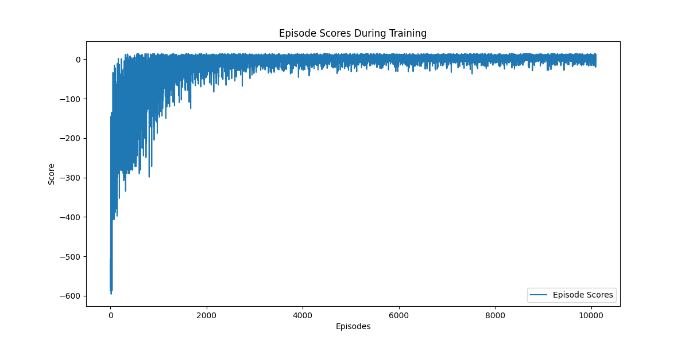

# Q-Learning Agent for Taxi-v3
This Python script implements a Q-learning algorithm to train an agent in the "Taxi-v3" environment from the Gymnasium library.
The agent learns to pick up and drop off a passenger at different locations in the most efficient manner

Here is graph with 10k training iterations:

Here is graph with 100k training iterations:
